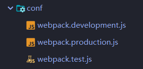
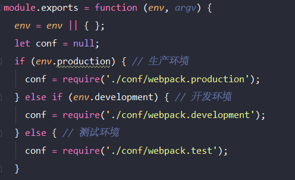
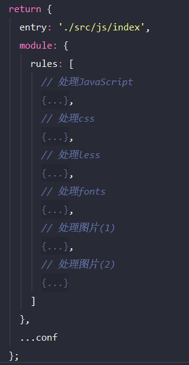

# webpack-configuration-template
webpack基本配置模板

#### 1.基本模块

```json
"dependencies": {
    "@babel/core": "^7.10.5",
    "@babel/preset-env": "^7.10.4",
    "autoprefixer": "^9.8.5",
    "babel-loader": "^8.1.0",
    "css-loader": "^4.1.0",
    "eslint": "^7.5.0",
    "eslint-loader": "^4.0.2",
    "file-loader": "^6.0.0",
    "html-webpack-plugin": "^4.3.0",
    "jest": "^26.1.0",
    "jest-webpack": "^0.5.1",
    "less": "^3.12.2",
    "less-loader": "^6.2.0",
    "postcss-loader": "^3.0.0",
    "style-loader": "^1.2.1",
    "stylelint": "^13.6.1",
    "stylelint-config-standard": "^20.0.0",
    "stylelint-webpack-plugin": "^2.1.0",
    "url-loader": "^4.1.0",
    "webpack": "^4.44.0",
    "webpack-cli": "^3.3.12",
    "webpack-dev-server": "^3.11.0"
  }
```

#### 2.模块安装

```javascript
yarn i
```

#### 3.可选配置

```json
// 目标浏览器选择
"browserslist": [
    "> 0.5%",
    "last 1 version",
    "not dead"
  ]
```

```json
// stylelint 配置
"stylelint": {
    "extends": "stylelint-config-standard"
  }
```

```json
// 测试目录过滤
"jest": {
    "roots": [
      "./tests/"
    ]
  }
```

#### 4.webpack配置文件

分类配置文件：

​						

主配置文件：

​						

分类配置加载：

​						

分类文件处理：

​						

#### 5.脚本命令运行

```json
"scripts": {
    "start": "webpack-dev-server --env.development --open",
    "build": "webpack --env.production",
    "test": "jest"
  }
```

"yarn run start"：开发模式，development

"yarn run build"：生产模式，production

"yarn run test"：测试模式

